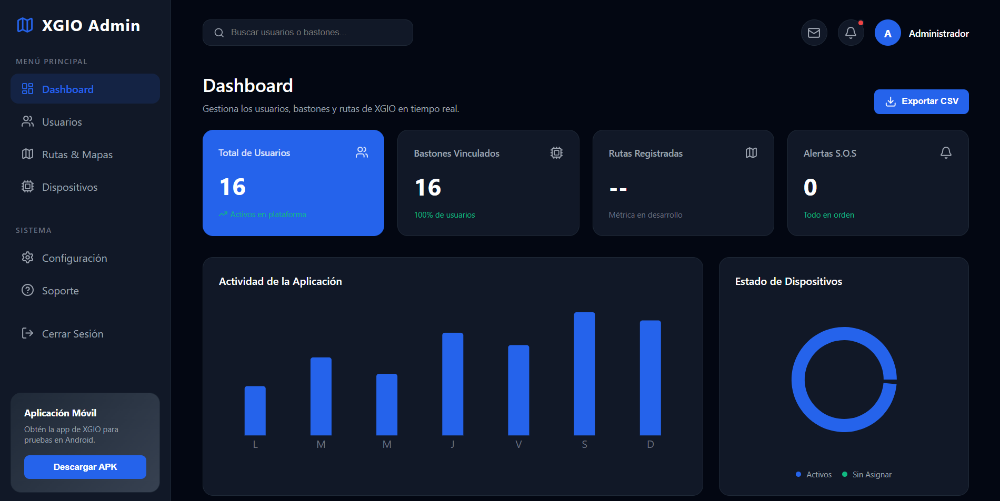
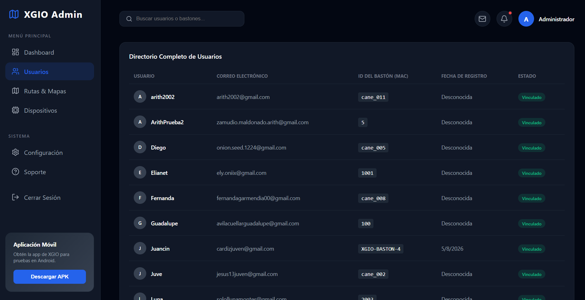
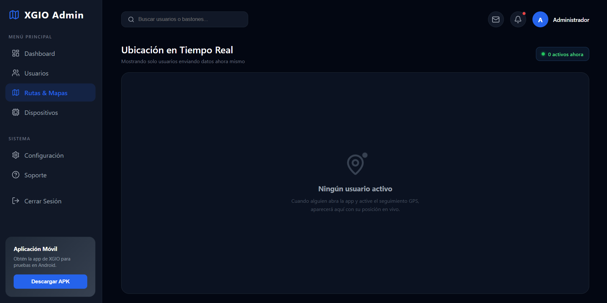
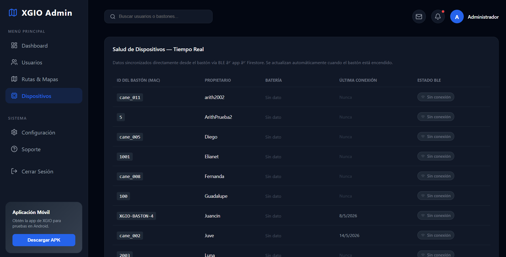
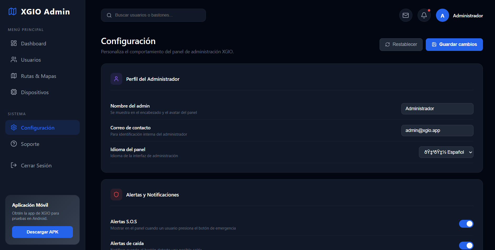

# Panel de Administracion (Dashboard Web)

El Dashboard de XGIO es una aplicacion web de administracion construida con **React + Vite**. Esta disenada para que los administradores monitoreen usuarios, bastones, rutas y alertas en tiempo real desde una sola interfaz.

!!! note "Acceso"
    El dashboard es una herramienta interna. No es publico. Esta pensado para el equipo de soporte, administradores y familiares cuidadores con permisos de gestion.

---

## Interfaz y Experiencia de Usuario (UI/UX)

El panel usa una interfaz en modo oscuro, con navegacion lateral fija, busqueda global, tarjetas de resumen y modulos especializados para operacion diaria.

### 1. Metricas Globales en Tiempo Real

La pantalla principal resume el estado general de la plataforma: usuarios registrados, bastones vinculados, rutas registradas y alertas S.O.S activas. Las metricas se alimentan desde Firestore para reflejar cambios de manera inmediata.

<div align="center">
  
</div>

!!! tip "Lectura rapida"
    La tarjeta de alertas permite detectar emergencias activas de inmediato, mientras que el grafico de actividad ayuda a revisar el comportamiento general de la aplicacion.

### 2. Directorio de Usuarios

El modulo de usuarios muestra el directorio completo con nombre, correo electronico, ID del baston, fecha de registro y estado de vinculacion. Desde esta vista el administrador puede revisar que usuarios ya tienen un baston asignado.

<div align="center">
  
</div>

!!! note "Gestion operativa"
    Esta tabla funciona como punto de control para validar registros, revisar correos y confirmar que cada usuario tenga asociado el baston correcto.

### 3. Rutas y Mapas

La pantalla de rutas y mapas concentra la ubicacion en tiempo real. El dashboard filtra usuarios activos y muestra el estado actual del rastreo GPS; cuando no hay usuarios enviando coordenadas, presenta un estado vacio claro.

<div align="center">
  
</div>

!!! tip "Tiempo real"
    El modulo esta pensado para mostrar solo usuarios con actividad reciente, evitando confundir ubicaciones antiguas con posiciones actuales.

### 4. Salud de Dispositivos

La seccion de dispositivos lista los bastones vinculados, su propietario, bateria, ultima conexion y estado BLE. Esto ayuda a identificar bastones sin conexion o sin datos recientes.

<div align="center">
  
</div>

!!! note "Monitoreo"
    Esta vista permite revisar rapidamente si un baston esta reportando informacion desde la app movil y Firestore.

### 5. Configuracion del Panel

La pantalla de configuracion permite personalizar el perfil del administrador, datos de contacto, idioma del panel y preferencias de alertas. Los cambios se guardan localmente para mantener la experiencia despues de recargar la pagina.

<div align="center">
  
</div>

!!! tip "Preferencias persistentes"
    Las opciones de configuracion se guardan en `localStorage`, por lo que no requieren una coleccion adicional en Firebase.

---

## Arquitectura y Stack

| Tecnologia | Uso |
|---|---|
| **React + Vite** | Framework de UI y bundler rapido |
| **Firebase Firestore** | Base de datos en tiempo real con `onSnapshot` |
| **Recharts** | Graficas de barras y donut para metricas |
| **Lucide Icons** | Iconografia del panel |
| **Google Maps Embed** | Mapa en tiempo real del usuario seleccionado |
| **localStorage** | Persistencia local de preferencias del administrador |

---

## Implementacion y Codigo

El dashboard esta construido alrededor de datos sincronizados en tiempo real y componentes reutilizables.

=== "admin/src/App.jsx - usuarios en tiempo real"
    ```jsx
    useEffect(() => {
      setLoading(true);

      const unsub = onSnapshot(collection(db, "users"), (snapshot) => {
        const usersList = [];
        snapshot.forEach((doc) => {
          usersList.push({ id: doc.id, ...doc.data() });
        });

        usersList.sort((a, b) => (a.name || "").localeCompare(b.name || ""));
        setUsers(usersList);
        setLoading(false);
      });

      return () => unsub();
    }, []);

    const activeCanesCount = users.filter(
      (user) => user.cane_id?.trim() !== ""
    ).length;

    const sosCount = users.filter(
      (user) => user.last_alert === "SOS"
    ).length;
    ```

=== "admin/src/App.jsx - mapa GPS"
    ```jsx
    const renderMap = () => {
      const ACTIVE_THRESHOLD_MS = 5 * 60 * 1000;
      const now = Date.now();

      const activeUsers = users
        .filter((user) => user.cane_id)
        .map((user) => {
          const locData = locationsByUser[user.id] || null;
          const last = locData?.last || null;
          const diffMs = last
            ? now - new Date(last.timestamp).getTime()
            : Infinity;

          return { ...user, last, diffMs };
        })
        .filter((user) => user.diffMs <= ACTIVE_THRESHOLD_MS)
        .sort((a, b) => a.diffMs - b.diffMs);

      const mapSrc = selected
        ? `https://www.google.com/maps?q=${selected.last.latitude},${selected.last.longitude}&z=17&output=embed`
        : null;

      return (
        <div>
          {mapSrc && <iframe src={mapSrc} title="Ubicacion en vivo" />}
        </div>
      );
    };
    ```

=== "admin/src/App.jsx - reset de alertas"
    ```jsx
    const resetAlerts = async () => {
      const usersWithAlerts = users.filter(
        (user) => user.last_alert === "SOS" || user.last_alert === "FALL"
      );

      for (const user of usersWithAlerts) {
        await updateDoc(doc(db, "users", user.id), {
          last_alert: null,
          sos: false,
        });
      }
    };
    ```

=== "admin/src/App.jsx - exportar CSV"
    ```jsx
    const exportToCSV = () => {
      if (users.length === 0) return;

      const headers = ["ID,Nombre,Correo,Cane_ID,Fecha_Registro\n"];
      const rows = users.map((user) =>
        `"${user.id}","${user.name || ""}","${user.email || ""}","${user.cane_id || ""}","${user.created_at || ""}"`
      );

      const csvContent =
        "data:text/csv;charset=utf-8," + headers.concat(rows).join("\n");

      const link = document.createElement("a");
      link.setAttribute("href", encodeURI(csvContent));
      link.setAttribute("download", "xgio_usuarios_export.csv");
      document.body.appendChild(link);
      link.click();
      document.body.removeChild(link);
    };
    ```

=== "admin/src/App.jsx - configuracion local"
    ```jsx
    const SETTINGS_KEY = "xgio_admin_settings";

    const defaultSettings = {
      adminName: "Administrador",
      sosEmailAlerts: true,
      sosSound: true,
      fallAlerts: true,
      batteryWarnThreshold: 30,
      batteryCriticalThreshold: 15,
      bleDeviceName: "XGIO-Cane-01",
    };

    function loadSettings() {
      try {
        const stored = localStorage.getItem(SETTINGS_KEY);
        return stored
          ? { ...defaultSettings, ...JSON.parse(stored) }
          : defaultSettings;
      } catch {
        return defaultSettings;
      }
    }

    const saveSettings = () => {
      setSettings(settingsDraft);
      localStorage.setItem(SETTINGS_KEY, JSON.stringify(settingsDraft));
    };
    ```

---

## Diseno y Paleta de Colores

El dashboard usa un tema oscuro consistente con la aplicacion movil:

```css
:root {
  --bg-dark: #030712;
  --bg-panel: #111827;
  --bg-panel-hover: #1f2937;

  --accent-blue: #2563eb;
  --accent-green: #10b981;
  --accent-red: #ef4444;
  --accent-amber: #f59e0b;

  --text-primary: #ffffff;
  --text-secondary: #9ca3af;
}
```

---

## Como Correr el Dashboard

```bash
cd admin
npm install
npm run dev
```

Abre [http://localhost:5173](http://localhost:5173) en tu navegador. Para que funcione, necesitas el archivo `admin/src/lib/firebase.js` con las credenciales de tu proyecto Firebase.
