# Hardware (Firmware)

El firmware es el codigo incrustado en el microcontrolador del baston inteligente. El nucleo del sistema corre sobre una placa basada en **ESP32**, con conectividad inalambrica para enviar telemetria a la nube y comunicarse con la app movil.

## Componentes Fisicos

- **Microcontrolador**: ESP32 / T-Beam para pruebas de integracion.
- **Modulo GPS**: receptor GNSS integrado o modulo externo segun la version de prototipo.
- **Acelerometro/Giroscopio**: MPU-6050 para deteccion de caidas.
- **Boton S.O.S**: push button con interrupciones de hardware.
- **Comunicacion**: Bluetooth/WiFi para app y nube; espacio reservado para antena LoRaWAN.
- **Notificaciones locales**: buzzer activo y motor de vibracion.

## Diseno Mecanico del Baston y Carcasa

Ademas del firmware y la electronica, se desarrollo un modelo mecanico del baston inteligente en **SolidWorks**. El objetivo del diseno fue integrar la placa **T-Beam** dentro de una carcasa compacta colocada en la parte superior del baston, manteniendo espacio interno para cableado, sujecion y la antena **LoRaWAN**.

El modelo contempla una carcasa tipo mango que protege la electronica y permite montar la placa sin dejarla expuesta. Tambien se dejo un canal y volumen libre para la antena LoRaWAN, ya que su posicion es importante para evitar interferencias mecanicas y mantener una mejor transmision.

<div align="center">
  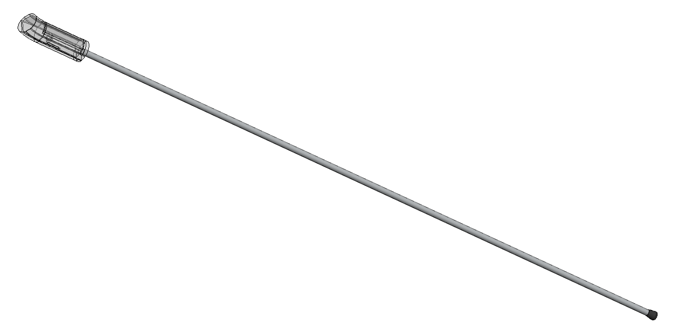
</div>

!!! note "Proposito del diseno"
    La carcasa fue pensada para alojar la placa T-Beam usada durante el desarrollo, proteger los componentes electronicos y conservar un espacio dedicado para la antena LoRaWAN.

### Carcasa Superior

La carcasa se diseno con una geometria cilindrica que se integra al tubo del baston. En las vistas ortogonales se puede observar la forma general del mango, los cortes laterales y el volumen reservado para los elementos internos.

<div align="center">
  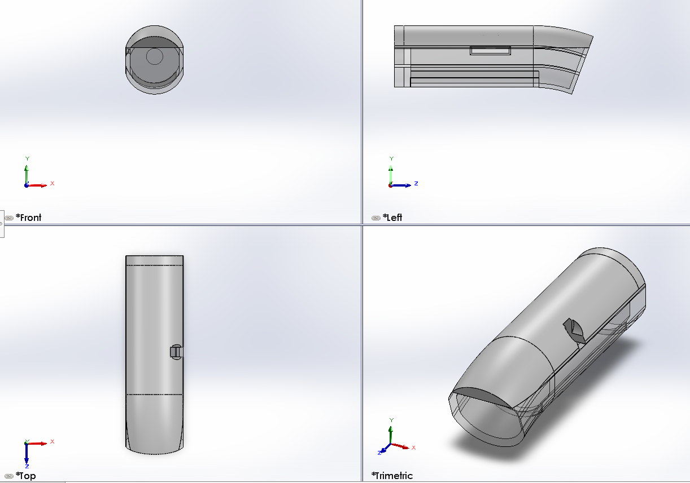
</div>

### Alojamiento de la Placa T-Beam

El interior de la pieza incluye un espacio rectangular para colocar la placa T-Beam. Este volumen ayuda a validar que la placa entre dentro de la carcasa y que exista separacion suficiente respecto a las paredes del modelo.

<div align="center">
  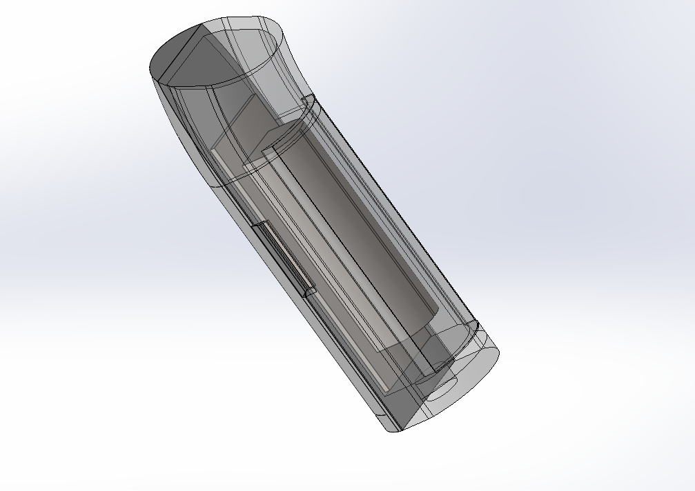
</div>

!!! tip "Integracion electronica"
    La T-Beam concentra microcontrolador, GPS y comunicacion LoRa. Por eso se considero desde el diseno mecanico, no como un agregado posterior.

### Espacio para Antena LoRaWAN

La carcasa deja un espacio longitudinal para la antena LoRaWAN y para el enrutamiento interno. Esta zona evita que la antena quede comprimida contra la placa o contra el cuerpo principal del baston.

<div align="center">
  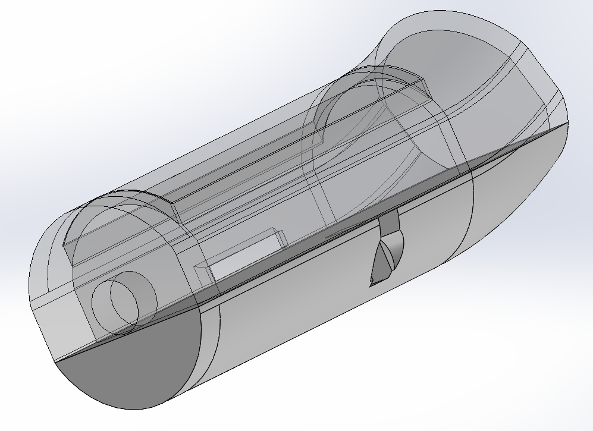
</div>

<div align="center">
  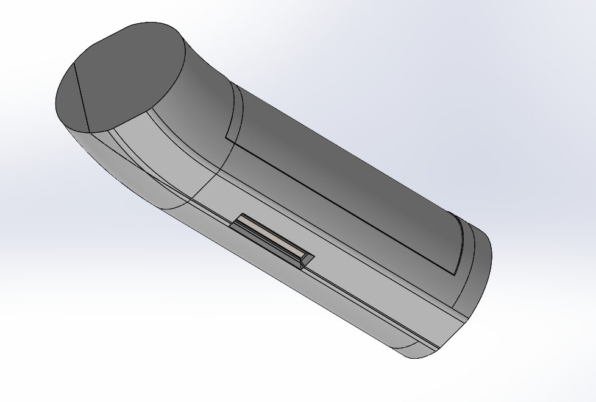
</div>

### Archivos CAD

Los archivos de SolidWorks se incluyeron en la documentacion para que el diseno pueda revisarse, modificarse o fabricarse posteriormente.

| Archivo | Descripcion |
|---|---|
| [Paquete completo SolidWorks](assets/cad/diseno_baston_solidworks.zip) | ZIP con el ensamble, piezas e imagenes originales |
| [Ensamble del baston](assets/cad/diseno_baston/baston_ensamble_completo.SLDASM) | Ensamble principal del diseno |
| [Carcasa del mango](assets/cad/diseno_baston/carcasa_mango_baston.SLDPRT) | Pieza principal de la carcasa |
| [Placa de referencia T-Beam](assets/cad/diseno_baston/placa_referencia_tbeam.SLDPRT) | Volumen usado para validar el espacio de la placa |

!!! note "Recomendacion"
    Para abrir el ensamble sin perder referencias, usa el paquete completo ZIP. Los archivos individuales tambien estan disponibles para revision rapida.

## Prototipo Impreso y Ajuste de Tolerancias

Despues del modelado inicial se imprimieron prototipos fisicos para validar medidas, ensamble y espacio real para la electronica. Las piezas blancas corresponden al primer diseno impreso; las piezas negras corresponden al diseno con modificaciones de tolerancias y medidas.

El modelo final conserva el alojamiento para la placa T-Beam, el hueco lateral de acceso y el volumen interno para cableado/antena. La iteracion en negro ya incluye correcciones dimensionales, aunque la impresion no salio correctamente porque la pieza se desplazo durante el proceso, probablemente despues de una pausa o interrupcion de la impresora.

<div align="center">
  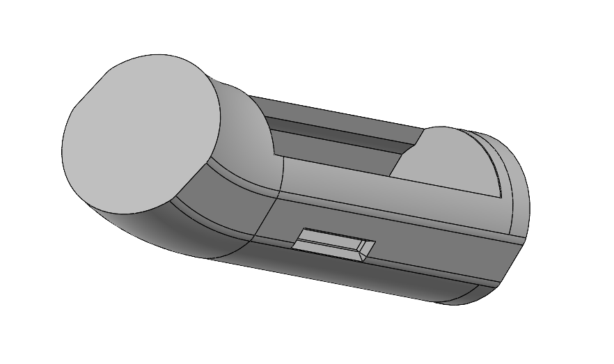
</div>

!!! note "Aprendizaje de fabricacion"
    Aunque el diseno negro ya tenia ajustes de tolerancia, la impresion quedo desplazada. Por eso se documenta como evidencia de prueba de fabricacion, no como pieza final aceptada.

### Primer Diseno Impreso

Las piezas blancas muestran la primera validacion fisica del mango. Sirvieron para revisar la forma general, la apertura frontal, los cortes laterales y el volumen de la carcasa antes de ajustar tolerancias.

<div align="center">
  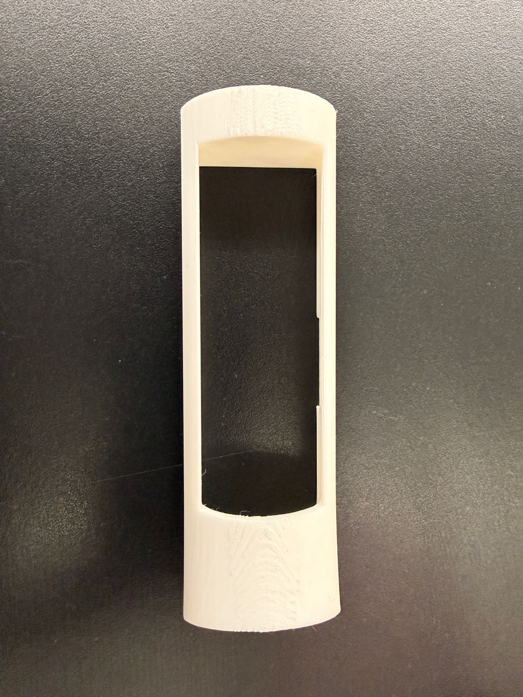
</div>

<div align="center">
  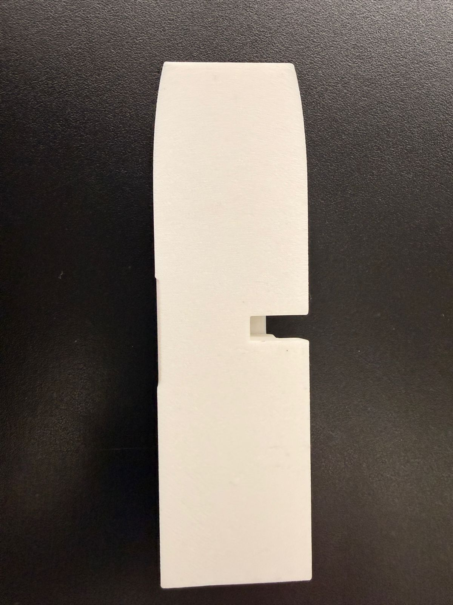
</div>

<div align="center">
  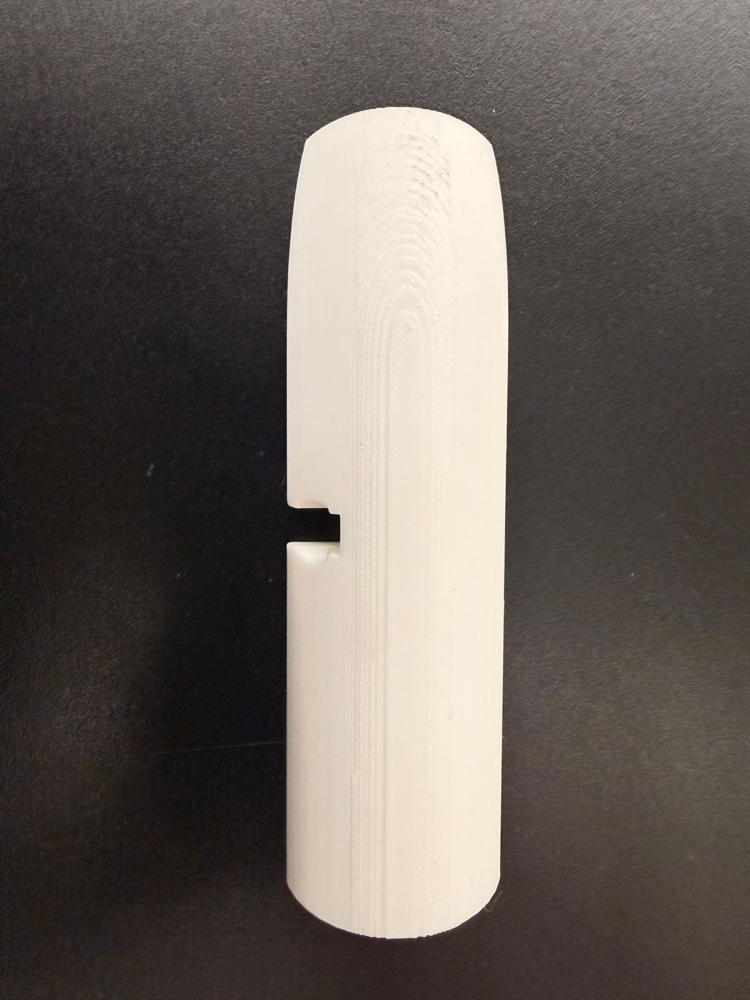
</div>

<div align="center">
  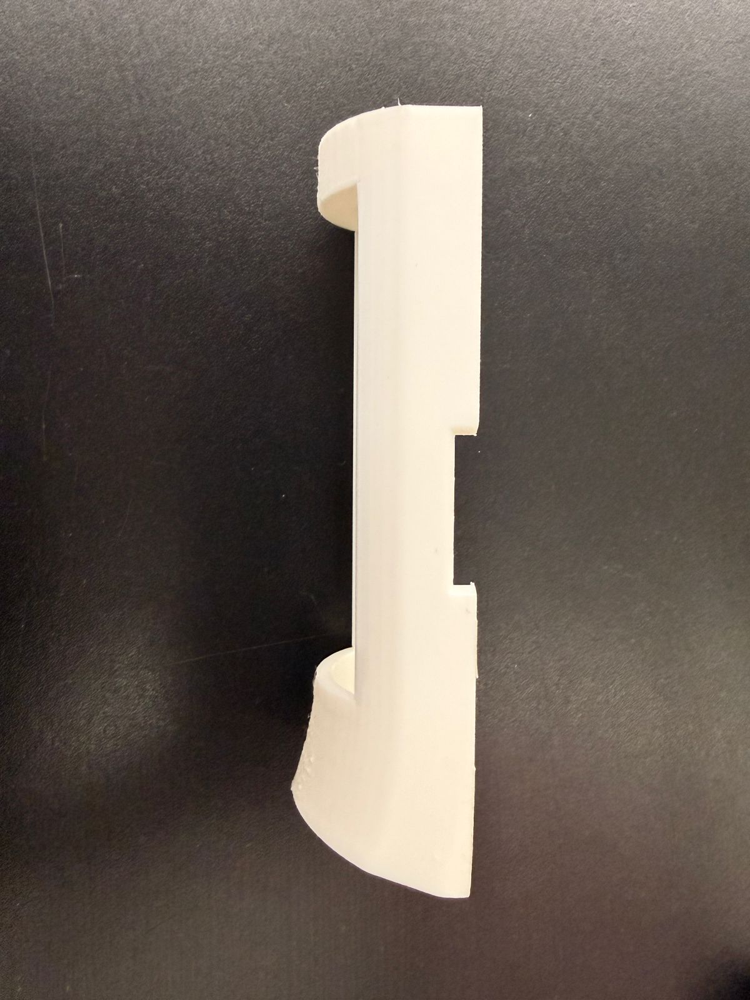
</div>

### Diseno Negro con Correcciones

Las piezas negras corresponden al diseno modificado con tolerancias y medidas corregidas. En estas fotos se aprecia mejor el alojamiento interno, los postes de sujecion y el espacio para la placa, pero tambien se observa el desplazamiento de capas provocado durante la impresion.

<div align="center">
  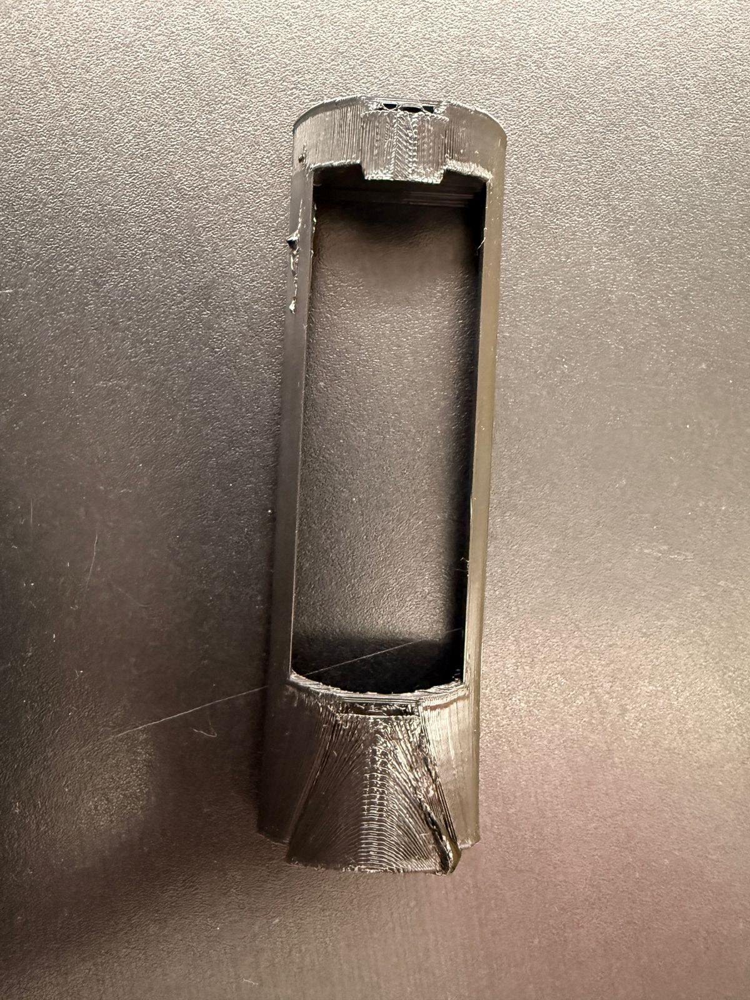
</div>

<div align="center">
  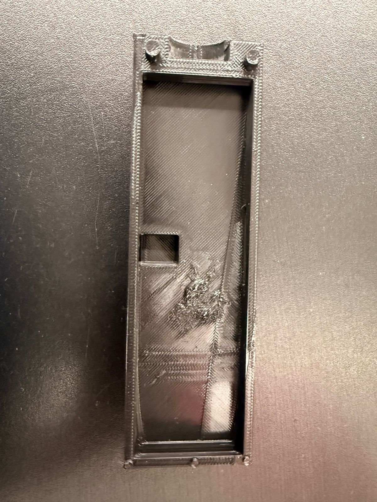
</div>

<div align="center">
  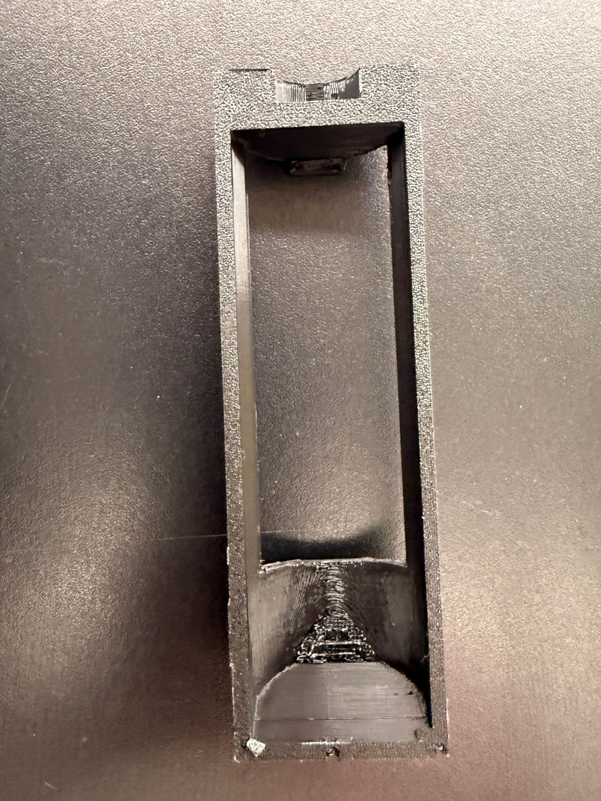
</div>

<div align="center">
  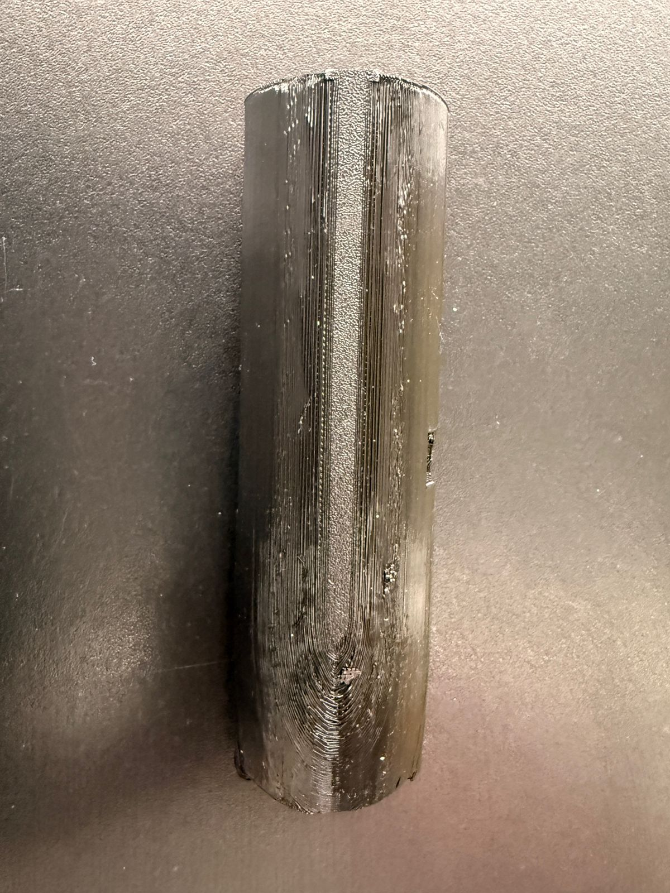
</div>

### Archivos Finales de Impresion

Para esta iteracion se agregaron los archivos finales del mango corregido en formato **STL** y **SLDPRT**. El STL se usa para rebanado e impresion 3D, mientras que el SLDPRT conserva el modelo editable en SolidWorks.

| Archivo | Descripcion |
|---|---|
| [STL final con tolerancias](assets/cad/diseno_baston/carcasa_mango_final_tolerancias.STL) | Modelo final para impresion 3D |
| [SLDPRT final editable](assets/cad/diseno_baston/carcasa_mango_final_tolerancias.SLDPRT) | Pieza final editable en SolidWorks |
| [Ensamble final](assets/cad/diseno_baston/baston_ensamble_final_tolerancias.SLDASM) | Ensamble actualizado con la carcasa corregida |
| [Paquete final de impresion](assets/cad/diseno_baston_impresion_final.zip) | ZIP con STL, SLDPRT y ensamble final |

## Codigo C++ (Arduino Core)

El codigo principal utiliza un modelo basado en maquinas de estados y subrutinas para no bloquear el procesador. El baston toma lecturas GPS, detecta eventos importantes y publica telemetria para que la app y el dashboard puedan mostrar el estado del usuario.

```cpp
// Fragmento de lectura de GPS y publicacion en Firebase
#include <TinyGPS++.h>
#include <Firebase_ESP_Client.h>

TinyGPSPlus gps;
FirebaseData fbdo;

void updateLocation() {
  while (SerialGPS.available() > 0) {
    gps.encode(SerialGPS.read());
  }

  if (gps.location.isUpdated()) {
    float lat = gps.location.lat();
    float lng = gps.location.lng();

    FirebaseJson json;
    json.set("lat", lat);
    json.set("lng", lng);
    json.set("timestamp", ".sv/timestamp");

    if (Firebase.RTDB.setJSON(&fbdo, "/baston_1/ubicacion", &json)) {
      Serial.println("Ubicacion actualizada con exito en la nube.");
    } else {
      Serial.println("Error de red: " + fbdo.errorReason());
    }
  }
}
```
