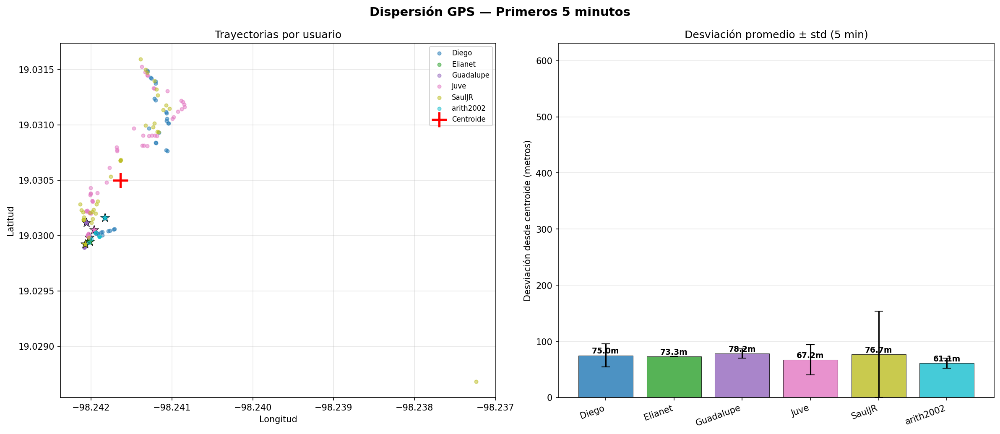
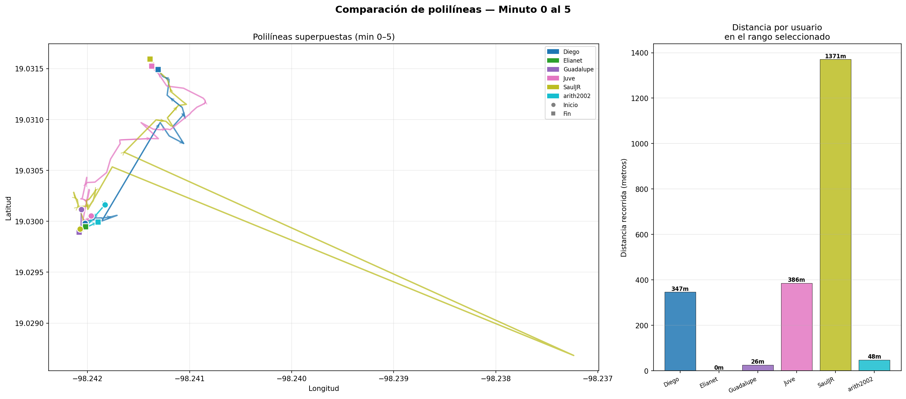
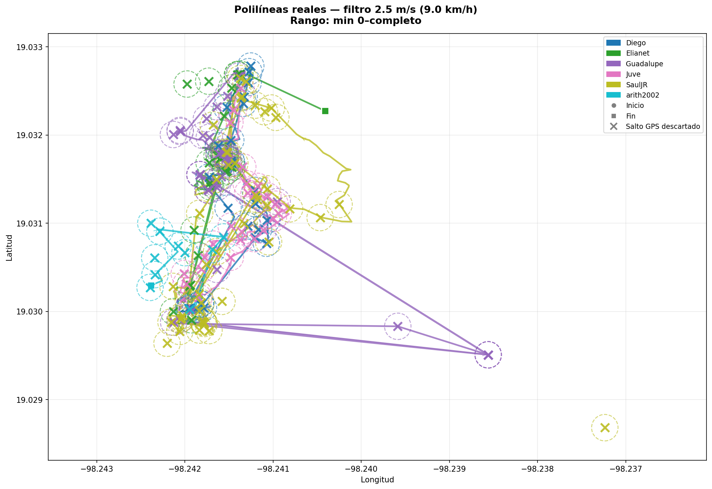

# Pruebas de Desempeño y Análisis GPS

Para garantizar la seguridad de los usuarios, la precisión del módulo GPS integrado en el bastón XGIO fue sometida a pruebas de estrés, comparando los datos crudos obtenidos del hardware (ESP32 + NEO-6M) con los trazados ideales y aplicando filtros en el backend para obtener polilíneas más limpias y precisas.

## 📊 Gráficas de Dispersión

El siguiente análisis de dispersión muestra la precisión posicional del GPS en un estado estático a lo largo de 5 minutos. El objetivo de esta prueba era evaluar la deriva ("drift") inherente al sensor.

  

**Interpretación de Resultados:**
- Los puntos representan cada lectura individual registrada. 
- La gran mayoría de las lecturas se concentran en un radio de acción cercano (formando una nube densa en el centro de la gráfica). Esto confirma que el margen de error promedio del módulo NEO-6M es de aproximadamente 2.5 metros, lo cual es más que aceptable para monitoreo en exteriores y se ajusta a la velocidad de caminata estándar de un usuario con discapacidad visual.

## 🗺️ Trazado de Rutas (Polilíneas)

Para las pruebas dinámicas (en movimiento), comparamos los datos crudos transmitidos por el bastón con la ruta suavizada mediante algoritmos en el servidor.

### Datos Crudos (Primeros 5 minutos)

  

**Interpretación de Resultados:**
- Al inicio de la marcha, el GPS tarda unos segundos en triangular múltiples satélites (Cold Start / Warm Start), lo que provoca saltos repentinos y líneas en "zigzag".
- Aunque los datos crudos demuestran que el bastón transmite de manera confiable a Firebase, ilustran el "ruido" común de la señal rebotando en edificios dentro de áreas urbanas.

### Polilíneas Limpias y Filtradas

  

**Interpretación de Resultados:**
- Al aplicar un algoritmo de umbral en el backend (filtrando puntos que sugieren saltos imposibles o velocidades superiores a 2.5 m/s para un peatón), obtenemos una trayectoria continua y suavizada.
- Este es el trazado definitivo que visualiza el Cuidador en la Aplicación Móvil, ofreciendo una experiencia fluida y reduciendo el pánico que podrían causar falsas lecturas de ubicación.
